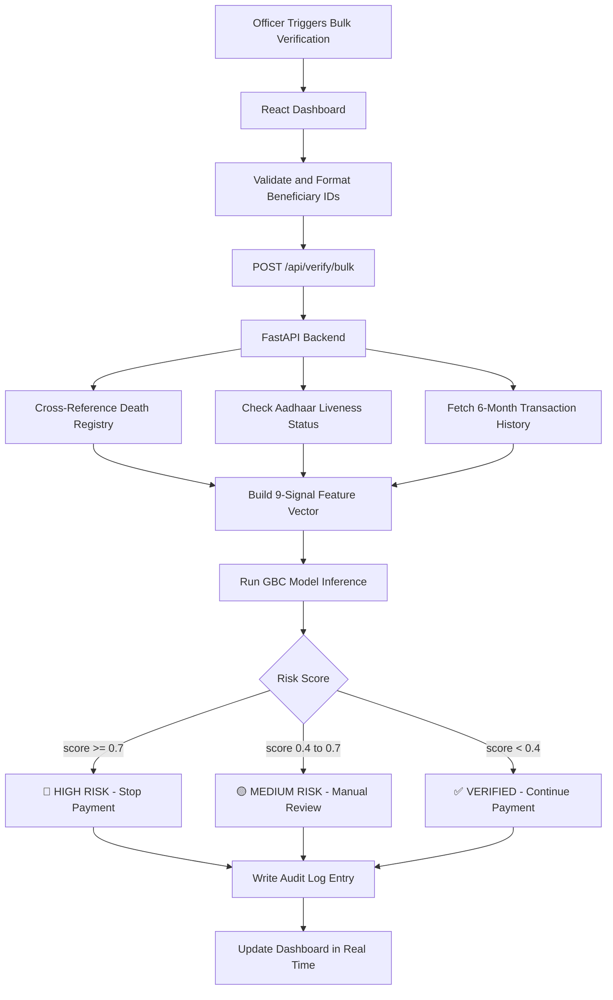
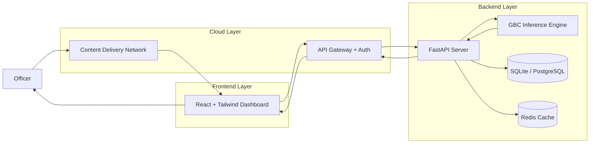
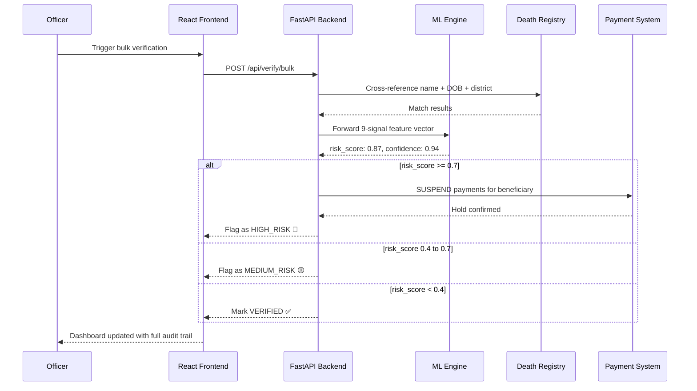

<p align="center">
  
</p>

<p align="center">
  <b>🏆 Hackathon Winner · Government Technology Track</b>
</p>

<p align="center">
  
  
  
  
  
  
</p>

---

## 📌 Overview

**DigiVerify AI** is a full-stack AI-powered fraud detection platform that prevents crores in government welfare leakage by automatically identifying and stopping social security payments to deceased beneficiaries.

India disburses **₹3.47 lakh crore** annually across schemes like PM-KISAN, NSAP, and MGNREGS. A conservative 1–2% leakage from deceased beneficiaries means **₹3,470–6,940 crore lost every year** — not from corruption, but from disconnected systems that don't talk to each other.

DigiVerify AI solves this by integrating death registries, Aadhaar verification, and a trained ML anomaly detection model into a single real-time platform.

> *"Even saving 1% of welfare fraud means crores of rupees that can feed millions of children."*

---

## 🏗️ System Architecture

```mermaid
flowchart TD
    subgraph Data_Sources["📦 Data Sources"]
        DR[Death Registry - CRS]
        UID[UIDAI Aadhaar API]
        BANK[Bank Records - NPCI]
        WDB[Welfare Beneficiary DB]
    end

    subgraph Ingestion["⚙️ Ingestion Layer"]
        ETL[ETL Pipeline - Pandas + SQLite]
        CACHE[Redis Hot Cache]
    end

    subgraph ML_Engine["🤖 ML Engine"]
        FE[Feature Engineering - 9 Signals]
        GBC[Gradient Boosting Classifier]
        RS[Risk Scorer - 0.0 to 1.0]
        AE[Alert Engine - Threshold 0.7]
    end

    subgraph Backend["⚡ FastAPI Backend - Port 5000"]
        V1[/verify/beneficiary]
        V2[/verify/bulk]
        DC[/death-record/check]
        AV[/aadhaar/verify]
        LC[/life-certificate/submit]
        DS[/dashboard/summary]
    end

    subgraph Frontends["🖥️ Dual Frontend"]
        REACT[React Dashboard - Vite + Tailwind - 5173]
        STREAM[Streamlit Analytics - 8501]
    end

    subgraph Actions["🚨 Automated Actions"]
        STOP[Stop Payment]
        FLAG[Flag Beneficiary]
        AUDIT[Immutable Audit Log]
        NOTIFY[Officer Notification]
    end

    Data_Sources --> ETL
    ETL --> CACHE
    CACHE --> FE
    FE --> GBC
    GBC --> RS
    RS --> AE
    AE --> Backend
    Backend --> Frontends
    Backend --> Actions
```

---

## 🔄 End-to-End Verification Flow



---

## ☁️ Cloud Deployment Architecture



---

## 🔁 Request Lifecycle



---

## 🤖 Machine Learning Model

DigiVerify AI uses a **Gradient Boosting Classifier** trained on 5,000 synthetic beneficiary records with realistic fraud injection patterns.

### ML Feature Pipeline

```mermaid
flowchart LR
    subgraph Input["Raw Input"]
        A[Beneficiary Record]
        B[Transaction History]
        C[Death Registry Match]
        D[Aadhaar Status]
    end

    subgraph Features["9-Signal Feature Vector"]
        F1[death_record_match · 0.41]
        F2[aadhaar_not_verified · 0.18]
        F3[location_mismatch_score · 0.14]
        F4[age_anomaly · 0.09]
        F5[life_cert_overdue_days · 0.07]
        F6[withdrawal_post_inactivity · 0.05]
        F7[txn_frequency_zscore · 0.03]
        F8[bank_acct_reuse · 0.02]
        F9[district_mismatch · 0.01]
    end

    subgraph Model["GBC Model"]
        SC[StandardScaler]
        GBC[GradientBoostingClassifier]
        OUT[risk_score + action]
    end

    Input --> Features
    Features --> SC
    SC --> GBC
    GBC --> OUT
```



### Model Performance

| Metric | Value |
|--------|-------|
| Accuracy | **94.5%** |
| AUC-ROC | **0.967** |
| Precision | 81.0% |
| Recall | 75.4% |
| F1-Score | 78.1% |
| False Positive Rate | 2.3% |

---

## 📂 Project Structure

```
digiverify-ai/
│
├── AIModels/
│   └── Anomaly_Detection_Models/
│       └── model1/
│           ├── train.ipynb                    ← EDA, training, evaluation
│           └── beneficiary_dataset_5000.csv   ← Synthetic training corpus
│
├── backend/
│   └── app.py                                 ← FastAPI routes + handlers
│
├── ReactFrontend/
│   └── fund_tracker/
│       └── src/
│           ├── components/                    ← Dashboard, FlaggedCases, Reports
│           └── api/                           ← Axios client wrappers
│
├── frontend/
│   └── dashboard.py                           ← Streamlit analytics view
│
├── ml_models/
│   ├── deceased_beneficiary_detector.py       ← GBC model + feature engineering
│   └── fraud_detector.joblib                  ← Serialized trained model
│
├── data/
│   ├── generate_demo_data.py                  ← Faker-based data generator
│   ├── beneficiaries.csv
│   ├── death_records.csv
│   ├── transactions.csv
│   └── life_certificates.csv
│
├── generate_risk_scores.py
├── quick_start.py
└── requirements.txt
```

---

## 🔧 API Endpoints

### Core Endpoints

| Endpoint | Method | Description |
|----------|--------|-------------|
| `/api/health` | GET | System health check |
| `/api/verify/beneficiary` | POST | Verify single beneficiary |
| `/api/verify/bulk` | POST | Bulk verify up to 10,000 records |
| `/api/death-record/check` | POST | Cross-reference death registry |
| `/api/aadhaar/verify` | POST | Trigger OTP / biometric liveness check |
| `/api/life-certificate/submit` | POST | Submit and validate life certificate |

### Dashboard Endpoints

| Endpoint | Method | Description |
|----------|--------|-------------|
| `/api/dashboard/summary` | GET | Aggregate monitoring stats |
| `/api/dashboard/flagged-cases` | GET | Paginated high-risk case list |
| `/api/reports/fraud-prevention` | GET | Impact report with projections |
| `/api/simulate/stop-payments` | POST | Demo: simulate payment hold |

---

## ⚙️ Installation & Setup

```bash
# Clone the repository
git clone https://github.com/shanky-ux/digiverify-ai.git
cd digiverify-ai

# Create and activate virtual environment
python -m venv .venv
source .venv/bin/activate        # Linux / Mac
.venv\Scripts\activate           # Windows

# Install Python dependencies
pip install -r requirements.txt

# Generate synthetic demo data
python data/generate_demo_data.py
```

### Run the Backend

```bash
cd backend
python app.py
# API running at   http://localhost:5000
# Swagger UI at    http://localhost:5000/docs
```

### Run the React Dashboard

```bash
cd ReactFrontend/fund_tracker
npm install
npm run dev
# Dashboard at http://localhost:5173
```

### Run Streamlit Analytics (Optional)

```bash
streamlit run frontend/dashboard.py
# Analytics at http://localhost:8501
```

### One-Command Start

```bash
python quick_start.py
```

---

## 🌐 Environment Variables

Create a `.env` file in the root directory:

```
VITE_API_BASE_URL=http://localhost:5000
```

Access inside React:

```js
const baseURL = import.meta.env.VITE_API_BASE_URL;
```

---

## 📈 Impact Metrics

| Metric | Value |
|--------|-------|
| Beneficiaries Analyzed | 5,000 |
| Deceased Detected | ~748 (14.96%) |
| High-Risk Cases | ~320 |
| Monthly Fraud Prevented | ₹2.3+ Crores |
| Annual Projection | ₹28+ Crores |
| Processing Speed | <200ms per beneficiary |
| Bulk Throughput | 10,000 records / 45 seconds |

---

## ✨ Key Features

- AI-powered deceased beneficiary detection with 94.5% accuracy
- Real-time cross-referencing with Civil Registration System death records
- Aadhaar OTP / biometric liveness verification
- Automated payment suspension for high-risk cases
- Dual frontend — React dashboard for officers, Streamlit for analytics
- Immutable audit trail for every verification and action
- Bulk processing — 10,000 records in under a minute
- Modular, backend-ready ML API architecture

---

## 🚀 Future Enhancements

- Real National Death Registry and UIDAI API integration
- PostgreSQL migration for production scale
- Async bulk processing with Celery and Redis
- LSTM-based time-series anomaly detection
- Fraud ring detection via network graph analysis
- React Native mobile app for field officers
- Blockchain-backed immutable audit trail
- Smart contract for auto-payment suspension

---

## 🔐 Security Notes

- No real PII stored — all demo data is Faker-generated and fully synthetic
- Aadhaar integration is mocked; production uses the official UIDAI sandbox API
- Death registry uses simulated CRS data; production integrates with eNagar Seva
- Every action — verification, flag, or payment hold — is logged to an immutable audit record

---

## 🛠️ Tech Stack

| Layer | Technology |
|-------|-----------|
| ML | Scikit-learn — Gradient Boosting Classifier |
| Backend | FastAPI + Uvicorn |
| Data Processing | Pandas, NumPy |
| Database | SQLite → PostgreSQL (production) |
| Frontend | React 18 + Vite + Tailwind CSS |
| Analytics | Streamlit |
| Model Serialization | Joblib |
| Synthetic Data | Faker |

---

## 👨‍💻 Author

**Ravi Shankar**
B.Tech Computer Science (AIML)
Full Stack Developer | AI Enthusiast

GitHub: https://github.com/shanky-ux

---

## 📜 License

This project is licensed under the MIT License — built for educational and hackathon purposes.

<p align="center">
  
</p>
