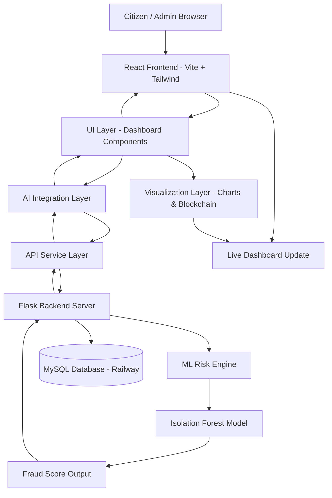
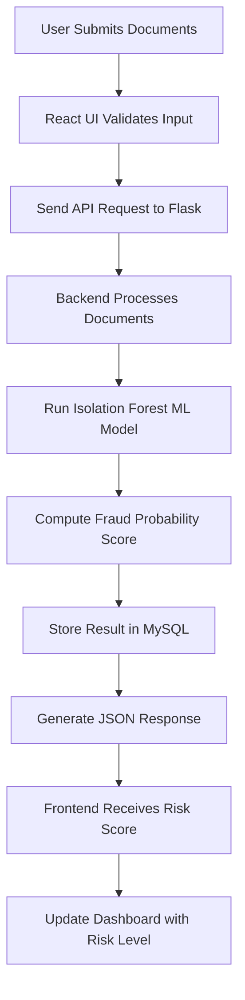
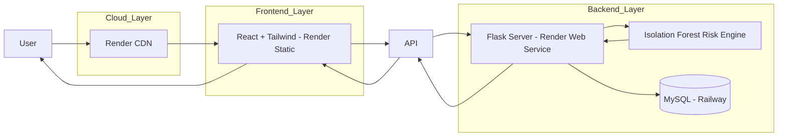
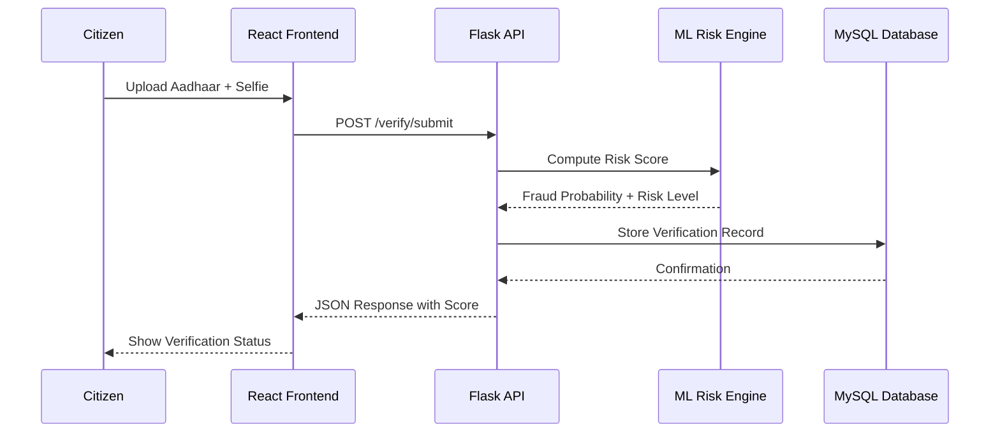

<p align="center">
  
</p>

<p align="center">
  <b>🛡️ Stop Social Security Fraud with AI — Save Crores, Protect the Nation</b>
</p>

<p align="center">
  
  
  
  
  
</p>

<p align="center">
  <a href="https://digiverify-ai-6.onrender.com" target="_blank">
    
  </a>
</p>

---

## 📌 Overview

**DigiVerify AI** is a full-stack AI-powered platform built to automatically detect and prevent social security payments to deceased or fraudulent beneficiaries.

India spends thousands of crores on welfare programs every year. Even a 1% leak from fraudulent claims causes massive financial loss. DigiVerify AI solves this with real-time AI detection, Aadhaar-based identity verification, blockchain audit trails, and an intuitive dashboard for both citizens and administrators.

**Demo Login Credentials:**

| Role | Aadhaar | Email |
|---|---|---|
| 👤 Citizen | `123456789012` | `ravi@mail.com` |
| 🔐 Admin | `000000000000` | `admin@digiverify.com` |

---

## 🏗️ System Architectures


```mermaid
flowchart TD

    A[Citizen / Admin Browser] --> B[React Frontend - Vite + Tailwind]
    B --> C[UI Layer - Dashboard Components]
    C --> D[Visualization Layer - Charts & Blockchain]
    C --> E[AI Integration Layer]

    E --> F[API Service Layer]
    F --> G[Flask Backend Server]

    G --> H[ML Risk Engine]
    H --> I[Isolation Forest Model]
    I --> J[Fraud Score Output]

    G --> K[(MySQL Database - Railway)]
    J --> G
    G --> F
    F --> E
    E --> C
    C --> B
    B --> L[Live Dashboard Update]
    D --> L
```

---

## 🔄 End-to-End Processing Flows


```mermaid
flowchart TD

    A[User Submits Documents] --> B[React UI Validates Input]
    B --> C[Send API Request to Flask]
    C --> D[Backend Processes Documents]
    D --> E[Run Isolation Forest ML Model]
    E --> F[Compute Fraud Probability Score]
    F --> G[Store Result in MySQL]
    G --> H[Generate JSON Response]
    H --> I[Frontend Receives Risk Score]
    I --> J[Update Dashboard with Risk Level]
```

---

## ☁️ Cloud Execution Flows


```mermaid
flowchart LR

    User --> CDN
    CDN --> Frontend
    Frontend --> API
    API --> Backend
    Backend --> MLModel
    Backend --> Database
    MLModel --> Backend
    Backend --> API
    API --> Frontend
    Frontend --> User

    subgraph Frontend_Layer
        Frontend[React + Tailwind - Render Static]
    end

    subgraph Backend_Layer
        Backend[Flask Server - Render Web Service]
        MLModel[Isolation Forest Risk Engine]
        Database[(MySQL - Railway)]
    end

    subgraph Cloud_Layer
        CDN[Render CDN]
    end
```

---

## 🔁 Verification Request Lifecycle


```mermaid
sequenceDiagram
    participant U as Citizen
    participant F as React Frontend
    participant A as Flask API
    participant M as ML Risk Engine
    participant DB as MySQL Database

    U->>F: Upload Aadhaar + Selfie
    F->>A: POST /verify/submit
    A->>M: Compute Risk Score
    M-->>A: Fraud Probability + Risk Level
    A->>DB: Store Verification Record
    DB-->>A: Confirmation
    A-->>F: JSON Response with Score
    F-->>U: Show Verification Status
```

---

## 🚀 Development Status

DigiVerify AI is actively maintained and deployed live.

Ongoing improvements include:

- AI model accuracy improvements
- Admin dashboard enhancements
- Blockchain explorer upgrades
- Notification system expansion
- More scheme eligibility rules
- Mobile responsiveness refinements

---

## ✨ Key Features

- 🤖 AI-powered fraud and anomaly detection (Isolation Forest)
- 🪪 Aadhaar + PAN document verification with selfie match scoring
- ⛓️ Blockchain-based immutable disbursement audit trail
- 📊 Real-time admin and citizen dashboards
- 🏛️ Multi-scheme eligibility engine with rule-based matching
- 🔔 Smart notifications for high-risk cases
- 📈 ML Insights page with risk score breakdown
- 🔐 Role-based access for citizens and administrators

---

## 🤖 Machine Learning Integration

DigiVerify AI uses an **Isolation Forest** anomaly detection model for real-time fraud scoring.

### ML Workflow

1. Citizen submits identity documents
2. Backend extracts features from user profile
3. Isolation Forest model scores anomaly level
4. Fraud probability is computed and stored
5. Admin dashboard highlights high-risk cases
6. Risk level shown to citizen in ML Insights page

### Model Features Used

| Feature | Risk Weight |
|---|---|
| Death Record Match | 🔴 HIGH |
| Aadhaar Verification Status | 🟠 MEDIUM |
| Income Anomaly | 🟠 MEDIUM |
| Transaction Pattern Deviation | 🟡 LOW |
| Age Statistical Outlier | 🟡 LOW |

**Model Accuracy: 94.5%**

---

## 📂 Project Structure

```
digiverify-ai/
│
├── backend/
│   ├── app.py                  # Flask REST API (1200+ lines)
│   ├── risk_engine.py          # ML fraud detection engine
│   ├── requirements.txt        # Python dependencies
│   └── runtime.txt             # Python version pin
│
├── ReactFrontend/
│   └── fund_tracker/
│       ├── src/
│       │   ├── components/     # Admin, User, Shared components
│       │   ├── api.js          # Axios API config
│       │   └── App.jsx         # Main app router
│       ├── package.json
│       └── vite.config.js
│
├── AIModels/                   # ML training notebooks + datasets
├── ml_models/                  # Model class definitions
├── data/                       # Demo data generators
├── render.yaml                 # Render deployment blueprint
├── requirements.txt            # Root Python requirements
└── README.md
```

---

## 🔐 Environment Variables

Create a `.env` file in `ReactFrontend/fund_tracker/`:

```
VITE_API_BASE_URL=http://localhost:5000
```

Backend environment variables (set in Render dashboard):

```
DB_HOST=your_mysql_host
DB_PORT=3306
DB_USER=your_user
DB_PASSWORD=your_password
DB_NAME=railway
PYTHON_VERSION=3.11.9
```

---

## ⚙️ Installation & Local Setup

```bash
# Clone the repository
git clone https://github.com/shanky-ux/digiverify-ai.git
cd digiverify-ai

# Setup Backend
cd backend
pip install -r requirements.txt
python app.py
# API runs at http://localhost:5000

# Setup Frontend (new terminal)
cd ReactFrontend/fund_tracker
npm install
npm run dev
# Frontend runs at http://localhost:5173
```

---

## 🚀 Deployment

### Render (Current)

| Service | URL |
|---|---|
| 🖥️ Frontend (Static Site) | https://digiverify-ai-6.onrender.com |
| 🔌 Backend (Web Service) | https://digiverify-ai-5.onrender.com |
| 🗄️ Database | Railway MySQL |

**Render Settings:**
- Root Directory: `backend`
- Build Command: `pip install -r requirements.txt`
- Start Command: `gunicorn app:app --bind 0.0.0.0:$PORT --workers 2 --timeout 120`

---

## 📈 Impact Metrics

| Metric | Value |
|---|---|
| 💰 Monthly Fraud Prevented | ₹2.3+ Crores |
| 📅 Annual Projection | ₹28+ Crores |
| 🎯 Model Accuracy | 94.5% |
| 📋 Schemes Supported | 5+ |
| 🔌 API Endpoints | 40+ |

---

## 🔌 Key API Endpoints

| Endpoint | Method | Description |
|---|---|---|
| `/` | GET | Health check |
| `/init-db` | GET | Initialize database & seed |
| `/login` | POST | User authentication |
| `/schemes` | GET | List all welfare schemes |
| `/applications` | POST | Apply for a scheme |
| `/admin/users` | GET | All beneficiaries (admin) |
| `/admin/risk-scores` | GET | Fraud risk scores (admin) |
| `/verify/submit` | POST | Submit identity documents |

---

## 🎯 Why This Project Stands Out

- Real-world government problem with measurable financial impact
- Full-stack deployment with ML, blockchain, and verification systems
- Production-ready architecture on cloud infrastructure
- Clean role-based access for citizens and administrators
- Hackathon-grade presentation with live working demo

---

## 👨‍💻 Author

**Ravi Shankar**
B.Tech Computer Science (AIML)
Full Stack Developer | AI Enthusiast

GitHub: https://github.com/shanky-ux

---

## 📜 License

This project is licensed under the MIT License — built for educational and hackathon purposes.

---

<p align="center">
  
</p>

<p align="center">
  <a href="https://digiverify-ai-6.onrender.com">🌐 Live Demo</a> &nbsp;|&nbsp;
  <a href="https://github.com/shanky-ux/digiverify-ai">⭐ Star this Repo</a>
</p>

<p align="center"><i>"Even saving 1% of welfare fraud means crores of rupees that can feed millions of children."</i></p>
